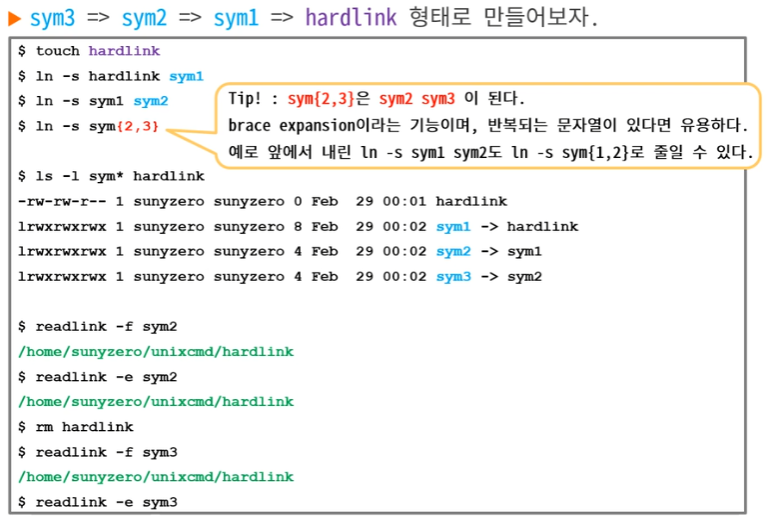

---

layout: single

title: "[2023-03-21] 2. 파일 관련 명령어"

categories: Devcourse-TIL

tags: Linux

toc: true

toc_label : 목차

toc_sticky: true

author_profile: false

sidebar :
    nav : "docs"
---

### Directory : 절대/상대 경로

#### Absolute Path(절대경로)

- root 디렉터리(/)를 시작으로 하는 경로

  e.g. /usr/local/bin
  
  

#### Relative Path(상대경로)

- 현재 디렉터리(.)를 시작으로 하는 경로

  - dot(.)는 생략 가능

  e.g. ../../tmp (./../../tmp와 같음)

  

### Command

#### pwd 

- print working directory

- 현재 디렉터리의 위치를 표시

  

#### cd 

- change directory

- cd [경로] 

  e.g.  cd ~/work, cd

- 경로를 생략하면 홈 디렉터리로 이동

  

#### ls

- list file

- ls [옵션] [파일명 ...]

  e.g.  ls -l, ls -a, ls -i 

  - -l : 자세히 출력
  - -a : 숨김파일을 포함한 모든 파일 출력
  - -R : 위치한 디렉토리 하부의 디렉토리 파일까지 모두 출력
  - -h : 파일 크기를 해석하기 편하게 출력
  - -r : 내림차순으로 출력
  - -t : 파일의 수정시간을 기준으로 출력

-  옵션을 한번에 여러개 입력할 수 있음

  e.g.  ls -al : 숨긴파일을 포함한 모든 파일들을 자세히 출력


- ls -a / ls -al을 입력하면 다음과 같은 결과가 나옴

### Octal mode


- **r**eadable : 4  /  **w**ritable : 2  /  e**x**ecutable : 1 

- 3칸씩 owner, group, others로 권한을 나눔

  e.g.  rwxr-x--- : owner(rwx), group(r-x), others(---) 

  - owner은 읽기, 쓰기, 실행이 가능
  - group은 읽기, 실행이 가능하며 쓰기는 불가능
  - other은 읽기, 쓰기, 실행 모두 불가능

- 기본 모드의 값은 umask의 값을 뺀 나머지

  - 디렉터리의 기본 mod 값은 777
  - 파일의 기본 mod 값은 666

  e.g.  umask의 값이 022일 경우에 디렉터리는 755, 파일은 644가 기본 mode가 됨


#### mkdir

- make directory

- mkdir [-p] &#60;directory name&#62;

  - -p : 존재하지 않은 중간의 디렉터리를 자동으로 생성

  e.g.  mkdir -p f1/f2/f3 : f1/f2 파일이 없어도 중간 디렉터리까지 자동으로 생성


#### rmdir

- remove directory
- rmdir [-p] &#60;directory name&#62;
- 디렉터리가 비어있는 경우에만 사용 가능
- rmdir 대신 rm -rf로 파일과 디렉터리를 함께 지우는 경우가 더 많음


#### cp

- copy

  

#### mv

- move, rename

- mv [옵션] [원본파일] [이동위치]

  - -f : 파일이 이미 있어도 강제로 이동
  - -i : 파일이 이미 있는 경우 덮어쓸지 물음

  e.g.  mv  /root/move_file  /tmp/move_file

  

#### rm

- remove

- rm [옵션] [파일 및 디렉토리명]

  - -f  : 강제로 파일이나 디렉터리를 삭제 및 대상이 없는 경우에는 메시지를 미출력
  - -r : 디렉터리 내부의 모든 내용 및 디렉터리 삭제
  - -d : 비어있는 디렉터리들만 제거

  e.g.  rm -rf new_folder : 디렉터리 삭제시 삭제 확인 메시지 미출력


#### chmod

- change mode

- chmod [옵션] [파일명]

e.g.  chmod 640 myfile 


#### chown

- change owner

- root 유저만 가능

  

#### chgrp

- change group

- root 유저만 가능

  

#### chattr

- change attribute
- 리눅스 파일 시스템의 커스텀 속성 변경


#### file

- 파일의 타입 확인 (파일 고유의 표식으로 파일 종류를 분류)
- file [파일명]


#### stat

- status of file : 파일의 메타 데이터를 출력 (수식하는 정보)
- stat [옵션] [파일명]


#### touch

- 파일의 메타 정보를 업데이트

- 파일이 존재하지 않는 경우 빈 파일 생성

  

#### find

- find directory [expression(조건)]


#### ln

- make links
- ln [옵션] [원본파일] [대상파일/디렉터리]
- i-node : 파일의 메타 정보(시간 관련 정보, 사이즈, 소유권, 권한 등) 및 관리용 객체
  - 파일은 고유의 i-node를 1개 갖고 있음
  - 디스크 파티션/볼륨 내에서 유일한 식별자
  - 파티션이나 볼륨이 다르면 의미가 없는 번호


- 하드링크 : 원본파일과 동일한 내용으로 다른 이름으로 존재

  - 같은 i-node를 가리키므로 동일 파티션내에만 생성 가능
  - Regular file이 아닌 디렉터리나 디바이스 파일은 실체를 가진 파일 (디렉터리나 디바이스 파일은 불가)

  - 원본파일의 내용이 변경될 경우 링크파일의 내용이 자동으로 변경됨
  - 원본파일과 링크파일 2개가 서로 다른 파일이므로, 둘 중 하나를 삭제하더라도 나머지 하나는 남아있음


- 심볼릭링크 : 단순히 원본파일을 가리키는 링크만 시켜둔 것으로 바로가기 기능
  - 위치만 가리키므로 다른 파티션, 모든 종류의 파일에 만들 수 있음


#### which

- PATH에 존재하는 파일 검색

``` linux
$ which find
/user/bin/find

$ which bash
/bin/bash

$ which tcpdump
/user/bin/tcpdump
```


#### readlink

- 심볼릭링크가 여러 단계로 가리키는 파일의 Canonical Path(정규화 경로)를 따라감

  - Canonicalization : 상대적인 의미를 해석한 후 standard, offical의 대상을 한정하는 행위

  e.g.  옆집 주소 -> 철수네 옆집 주소

  - 심볼릭 링크도 실체를 가리키는 것이 아니므로, 따라가기 전에는 대상을 한정할 수 없음
  - 따라서 순차차적으로 따라가야 Cannonical Path를 알 수 있음

-  readlink [옵션] [링크파일 경로]



