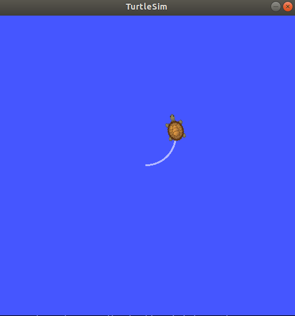

### 키보드로 거북이 조종

#### 실습 내용

- turtle_teleop_key 노드에서 turtlesim_node에게 키보드 정보의 토픽을 보내, turtlesim_node에서 거북이의 궤적을 표시하는 실습

#### 순서

1. 노드2(turtlesim_node, subsriber)가 자기의 **정보**를 마스터에게 알려줌
2. 노드1(turtle_teleop_key, publisher)가 자기의 **정보**를 마스터에게 알려줌
3. 마스터가 노드2에게 노드1의 정보를 알려줌
4. 노드2가 노드1에게 접속을 요청함
5. 노드1이 노드2의 접속 요청에 응답함
6. 노드1이 노드2에게 토픽을 전송함

#### 실습

- 터미널 4개를 키고 1번 터미널에서 `$ roscore`를 입력함
  - ROS Core 시작
- 4번 터미널에서 `$ rosnode list` 를 입력함
  - /rosout이 표시되는 것으로 보아, 현재 ROS Core가 정상적으로 실행되는 것을 알 수 있음

- 2번 터미널에서 `$ rosrun turtlesim turtlesim_node` 를 입력함

  - 거북이가 그려진 창이 뜸

- 4번 터미널에서 `$ rosnode list`를 입력함

  - 실행 중인 노드 리스트에 /turtlesim이 추가됨

  

- 3번 터미널에서 `$ rosun turtlesim turtle_teleop_key`를 입력함
  - 터미널이 활성화된 상태에서 키보드를 누르면 아까 열은 창의 거북이가 내가 누르는 방향키대로 움직임
- 4번 터미널에서 `$ rosnode list`를 입력함
  - 실행 중인 노드 리스트에 /teleop_turtle이 추가된 됨

#### 토픽 조사

- `$ rostopic list` 를 입력해 어떤 토픽이 날아다니는지 살펴볼 수 있음

- `$ rostopic echo /turtle1/cmd_vel`를 입력해 토픽에 담긴 메시지의 내용을 볼 수 있음
  - 터미널 3에서 방향키 누르면 메시지가 보임

- `$ rqt_graph` 를 입력해 노드와 토픽의 관계를 시각화할 수 있음

  

  

- `$ rostopic list -v ` 를 입력하여 토픽을 좀 더 자세히 살펴 볼 수 있음

  - Published topics와 Subsribed topics로 나눠서 알려주고 몇 명이 발행하는지 구독하는지도 알려줌

- `$ rostopic type` 를 입력하여 토픽에 발행되는 메시지의 타입을 알 수 있음
- `$ rostopic show ` 를 입력하여 메시지의 구성을 알 수 있음

- 토픽의 메시지가 궁금할 때 https://wiki.ros.org/ 에 들어가서 검색하면 됨

#### 토픽 직접 발행

- `rostopic pub -1 /turtle1/cmd_vel geometry_msgs/Twist -- '[2.0,0.0,0.0]' '[0.0, 0.0, 1.8]'` 를 입력하면 거북이를 입력한 대로 옮김

- `rostopic pub /turtle1/cmd_vel geometry_msgs/Twist -r 1 '[2.0,0.0,0.0]' '[0.0, 0.0, 1.8]'` 를 입력하면 1초에 한번씩(1hz) [2.0,0.0,0.0],[0.0, 0.0, 1.8] 움직임을 반복함

