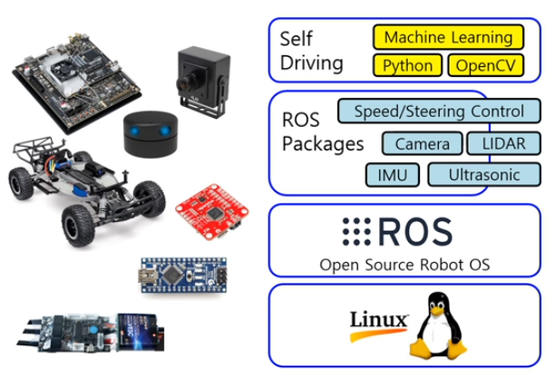

### 자이카

- 종류 및 스펙

- D 모델 구성 부품 및 시스템 구성도

- 자이카 소프트웨어 구성
  - 운영체제로 리눅스 설치
  - 각종 센서와 모터제어를 위한 미들웨어 ROS 설치
  - 자이카 장치제어를 위한 ROS Package 구축
  - 자율주행 SW 프로그래밍은 파이썬으로 작성 및 오픈소스 라이브러리 활용

- 다양한 미션 수행
  - 직선 주행
  - 곡선 주행
  - 정지선
  - 돌발 장애물
  - U턴
  - 로터리 진입과 진출
  - 차선 변경
  - 신호등 신호 구분
  - 언덕
  - 요철 구간
  - 정차 등

