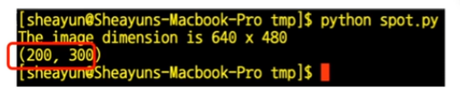

### OpenCV


#### OpenCV란?

- 컴퓨터비전을 위해 만들어진 공개 소프트웨어 (라이브러리 파일)
- 영상 데이터의 표현, 변환, 분석 등에 필요한 도구들을 제공
- 프로그래밍 인터페이스로는 주로 C++, Python 이용
- Windows, Linux, MacOS 등에서도 이용이 가능한 크로스 플랫폼 프레임워크
- 머신러닝 프레임워크 지원
- 자율주행 자동차에서는 카메라 영상을 가공하고 분석하여 상황을 인식할 때 사용함


#### 특징

- 오픈소스
  - BSD 라이선스 (무료 소프트웨어)

- 프로그래밍 편리
  - 대부분의 운영체제 지원 (Linux, Windows, MacOS, iOS, Android)
  - C, C++, Java, Python 지원 (내부적으로는 C/ C++ 실행하여 수행속도가 빠름)
  - 다양한 CPU와 GPU 하드웨어를 지원
- 많은 응용분야에서 사용
  - 구글, 마이크로소프트, 인텔, 삼성, 토요타, 등등
  - PC 응용프로그램, 모바일 앱, 임베디드, SW
  - 가전기기, 자동차, 로봇, ...


#### 버전

- 버전 1.x
  - C 언어로 작성됨
- 버전 2.x 
  - C ++ 언어로 재작성됨
- 버전 3.x
  - 모듈별로 라이브러리가 분리되어 있었으나 통합됨
  - OpenCL 지원을 통해 실행속도가 개선됨
  - 특징점 추출 알고리즘과 관련 기능이 보강되고 추가됨
- 버전 4.x
  - 딥러닝 패키지가 추가됨 (Yolo 등)


#### OpenCV의 이미지 표현 방식

- 점 하나(1 pixel)를 표현하는데 [B, G, R] 형태의 배열로 이루어짐

  e.g.  640 x 480 이미지에서 한 행에 680개씩, 총 480개의 행이 존재

  - 데이터 타입이 numpy.ndarray로 다차원 배열을 표현하는 구조 
  - 위 640 x 480 이미지의 배열의 형태는 (480, 640, 3) 


#### OpenCV 좌표계

- OpenCV를 이용한 Python 코딩에서는 좌표값 표시에 순서쌍(tuple)을 이용


#### 몇 가지 기본적인 도형 그리기

- 선

  - line(img, start, end, color, thickness)

  e.g.  img = cv2.line(img, (0,0), (511, 511), (255, 0, 0), 5)

  

- 사각형

  - rectangle(img, start, end, color, thickness)

  e.g.  img = cv2.rectangle(img, (100,100), (300, 500), (0, 255, 0), 3)

  

- 원

  - circle(img, center, radius, color, thickness)

  e.g.  img = cv2.circle(img, (300,400), 100, (0, 0, 255), 2)

  

- 텍스트

  - putText(img, text, org, font, fontscale, color)

  e.g.  cv2.putText(img, "Test", (10,50) cv2.FONT_HERSHEY_SIMPLEX, 4, (255, 255, 255))


#### 실습 예제 코드


#### 연습 : 사각형 그리기

- rectangle.py

```
import cv2

img = cv2.imread('black.png', cv2.IMREAD_COLOR) 
# cv2.imread(filename, flag) : 이미지 파일을 읽어 옴 (flag는 이미지 파일을 읽을 때 옵션)

img = cv2.rectangle(img, (100, 100), (300, 400), (0, 255, 0), 3)
# cv2.rectangle(img, pt1, pt2, thickness) : 사각형 그리기 
# pt1 : 시작점 / pt2 : 끝점 / thinkness : 두께 

cv2.imshow('black', img)
# cv2.imshow(title, image) : 화면에 이미지 파일 표시
# title : 창의 제목 의미
# image : cv2.imread()의 return 값 
cv2.waitKey(10000)
```


- 실행결과


#### 이미지 파일 다루기

- 이미지 파일 읽어들이기
  - imread(filename, flags)
  - img  =cv2.imread('picture.jpg', cv2.IMREAD_GRAYSCALE)
    - picture.jpg 파일을 그레이스케일(1채널 구조)로 읽어 img 라는 객체에 저장


- 화면에 이미지 표시하기
  - imshow(window_title, image)
  - cv2.imshow('Color', img)
  - img라는 객체에 저장되어 있는 이미지를 표시하되, 윈도우 창의 제목은 'Color'로 함


- 이미지를 파일로 저장하기
  - imwrite(filename, image)
  - cv2.imwrite('new_image.jpg', img)
  - img라는 객체에 저장되어 있는 이미지를 new_image.jpg 라는 이름의 파일로 저장


#### 연습 : 이미지 파일 읽어 화면에 표시

- girl.py

```
import cv2 # cv2 함수를 사용할거야~

img = cv2.imread("girl.png", cv2.IMREAD_COLOR) # girl.png 파일을 COLOR 로 읽어라

cv2.imshow("My Girl", img) # img 이미지를 표시하면서 윈도우 창의 제목은 "My Girl"로 나옴

cv2.waitKey(10000)

cv2.destroyAllWindows()
```


- 실행결과


#### 컬러 이미지와 그레이스케일 이미지 비교

- 흑백 spot.png & 칼라 girl.png


#### 연습 : 이미지 파일 읽어 화면에 표시

- spot.py

```
import cv2

img = cv2.imread("spot.png", cv2.IMREAD_GRAYSCALE)
h = img.shape[0]
w = img.shape[1] # h, w 값으로 이미지 파일 모양을 return

print("The image dimension is %d x %d" % (w, h))

for i in range(0, h-1) :
	for j in range (0, w-1) : 
		if img[i,j] == 255: # 하얀색
			print(i,j)
			
cv2.imshow('spot', img)

cv2.waitKey(1000)
```

- 실행결과




#### 연습 : 관심 영역(ROI) 설정

- 관심영역 - ROI(Region of Interest)

  - 이미지 화면 내에서 관심영역을 설정하는 일은 numpy.ndarray의 다차원 배열에서 특정영역을 잘라냄으로써 가능

  

- roi.py

```
import cv2

img = cv2.imread("cars.png")

cv2.imshow("car", img[120:270, 270:460]) #세로 픽셀, 가로 픽셀 순

cv2.waitKey(10000)
```


- 실행결과


#### HSV 색상 표현

- RGB 색상 표현 방식보다 색상 또는 명도를 기준으로 객체를 분할하여 내기가 용이하여 이미지 처리에 많이 이용되는 표현 방법

  - H : Hue(색상)

  - S : Saturation(채도)

  - V : Value(명도)


- HSV 색상 모델의 이용
  - Hue(색상) :  색의 질, 노란색, 빨간색, 파랑색, ... 
  - Saturation(채도) : 선명도, 원색에 가까울수록 채도가 높음
  - Value(명도) : 밝기, 명도가 높을수록 백색에 가깝고 낮을수록 흑색에 가까워짐


#### 연습 : 색상과 명도 범위로 차선 인식

- hsv.py

```
import cv2
import numpy as np

img = cv2.imread("cars.png")
hsv = cv2.cvtColor(img, cv2.COLOR_BGR2HSV) # convertColor 함수를 이용하여 BGR 데이터를 HSV로 바꾸고 hsv에 저장

lower_white = np.array([0,0,150]) 
upper_white = np.array([179,255,255]) # 색상 0~179, 채도 0~255, 명도 150~255 사이에 드는 범위를 지정

mask = cv2.inRange(hsv, lower_white, upper_white) # 범위에 포함되는 픽셀들은 흰색(255)로, 그 외의 픽셀들은 검은색(0)으로 이진화한 graycale 이미지를 만듬

cv2.imshow("line", mask)

cv2.waitKey(10000)
```


- 실행결과


- 명도 범위의 조정
  - 50 일때는 50~255까지 다 하양색으로 만듬
  - 100 일때는 100~255까지 다 하양색으로 만듬
  - 150 일때는 150~255까지 다 하양색으로 만듬


#### 동영상 파일 읽어서 표시

- 동영상 : 정지 이미지가 시간에 따라 바뀌며 나타나는 것
- 프레임 : 동영상 내에서 한장 한장의 그림을 프레임이라고 함
  - 얼마나 빠르게 다음 그림을 보여주는가 : fps (frame per second)
- 자율주행 알고리즘에서는 프레임 단위의 이미지를 분석하여 주행 제어를 결정함


#### 연습 : 동영상 파일 읽어 들여 표시하기

- video.py

```
import cv2

vid = cv2.VideoCapture('small.avi') # 읽고자하는 avi 파일

while True : 
	ret, frame = vid.read() 
	# vid.read로 비디오에서 하나의 프레임을 읽음 
	# ret은 프레임이 성공적으로 읽혔는지 나타내는 부울 값
	# frame은 Numpy 배열 형태로 된 프레임 데이터
	if not ret : # ret이 False 인경우 비디오 파일의 끝에 도달한 것으로, 루프에서 break 함
		break
    # frame = cv2.cvtColor(frame, cv2.COLOR_BGR2GRAY) # 색상 이미지를 그레이스케일로 변환
    if ret : # ret이 True 인 경우 
    	cv2.imshow('video', frame)
    if cv2.waitkey(1) > 0 : # 1ms 동안 사용자가 키 입력하는 것을 대기
    	break # 키를 입력하면 프로그램은 루프에서 나와 break
    	
vid.release() # VideoCapture 객체 해제
cv2.destroyAllWindows() 
```


#### 동영상 재생  vs  카메라 입력처리

- 카메라 영상을 표시하는 것과 동영상 파일을 열어 재생하는 것은 동일한 작업

- 카메라 영상(동영상 파일) 표시

  1. Video Capture 오브젝트를 생성함

  2. 카메라 디바이스 또는 동영상 파일 열기
  3. 순환문을 반복하면서 frame을 읽어들임
  4. 읽은 프레임을 변환하여 화면에 표시함
  5. 영상 재생이 끝나면 VideoCapture 오브젝트를 release 함
  6. 윈도우를 닫음


