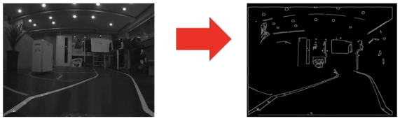

#### 차선을 따라 주행하기

- USB 카메라와 OpenCV를 이용하여 차선을 인식하고 인식된 차선을 따라 스스로 주행할 수 있는 자율주행 구현

- 차선 추종 주행
  - 좌우 차선을 찾아내어 차선을 벗어나지 않게 주행함
  - 아래와 같은 방법으로 차선을 찾을 수 있음


#### 차선을 찾기 위한 작업

- **Image Read** : 카메라 영상 신호를 이미지로 읽기
- **GrayScale** : 흑백 이미지로 변환
- **Gaussian Blur** : 노이즈 제거 (하얀점 99개 검정점 1개 일 경우 검정점 1개를 하얀색으로 뭉갬)
- **HSV** **- Binary** : HSV 기반으로 이진화 처리
- **ROI** : 관심 영역 잘라내기


#### 차선 검출을 위한 영상처리


##### gray.py

- 컬러(bgr8) 이미지를 흑백(grayscale) 이미지로 변환

```
import cv2
img = cv2.imread("sample.png")
gray = cv2.cvtColor(img, cv2.COLOR_BGR2GRAY)

cv2.imshow("gray", gray)
cv2.waitKey(10000)
```


##### blur.py

- 차선 인식에 방해가 되는 노이즈 제거

- Gaussian Blur

  - 각 픽셀에 5 x 5 윈도우를 올려 놓고 그 영역 안에 포함되는 값을 모두 더한 뒤 이것을 25개로 나누어 인접한 점들의 밝기의 산술 평균을 구해 노이즈를 제거 함 

  - 윈도우의 크기를 크게 할수록 더 부드러운 blur 결과물을 얻음

```
import cv2
img = cv2.imread("sample.png")
gray = cv2.cvtColor(img, cv2.COLOR_BGR2GRAY)
blur = cv2.GausssianBlur(gray, (5,5), 0) # 부드러운 영상으로 바꿔줌, 5x5 픽셀 영역의 값만을 고려하여 이미지를 필터링

cv2.imshow("gray", gray)
cv2.waitKey(10000)
```


##### line.py

- HSV 기반 이진화 방법으로 차선을 추출

```
import cv2
import numpy as np

image = cv2.imread("sample.png")
hsv = cv2.cvtColor(image, cv2.COLOR_BGR2HSV)

lower_white = np.array([0,0,70])
upper_white = np.array([131,255,255])

mask = cv2.inRange(hsv, lower_white, upper_white)

cv2.imshow("line", mask)
cv2.waitkey(10000)
```


##### canny.py (보너스)

- 외곽선을 추출해서 차선을 찾을 수도 있음 (Canny Edge Detector을 이용)

```
import cv2
image = cv2.imread("sample.png")
gray = cv2.cvtColor(img, cv2.COLOR_BGR2GRAY)
blur = cv2.GausssianBlur(gray, (5,5), 0)
edge = cv2.Canny(blur, 20, 190)

cv2.imshow("edge", edge)
cv2.waitkey(10000)
```




##### nonzero.py

- 사각형 안에 있는 흰색 점의 개수를 세서 일정 개수 이상이면 녹색으로 표시

```
import cv2
import numpy as np

image = cv2.imread("sample.png")
hsv = cv2.cvtColor(image, cv2.COLOR_BGR2HSV)

lower_white = np.array([0,0,70])
upper_white = np.array([131,255,255])
img = cv2.inRage(hsv, lower_white, upper_white)

xx= 20 
while True : # break 하기전에는 계속 도는데
	area = img[430:450, xx:xx+15]
	if cv2.countNonZero(area) > 200 : # area 영역 내의 흰색 픽셀의 개수가 200개 초과시
		image = cv2.rectangle(image,(xx,430),(xx+15,450),(0,255,0),3) # 두께가 3이고 초록색 사각형으로 영역 표시
	else : # 아닐 경우에는
		image = cv2.rectangle(image,(xx,430),(xx+15,450),(255,0,0),3) # 두께가 3이고 파란색 사각형으로 영역 표시
	xx = xx + 20 
	if xx > 640 :
		break
		
cv2.imshow("countNonZero", image)
cv2.waitkey(10000)
```


###### 관심영역 ROI 설정

- 동영상 파일의 프레임 크기 : 640 x 480
  - 세로 좌표 430~450 영역을 ROI로 설정
  - 가로 좌표 0~200과 440 ~640을 각각 왼쪽과 오른쪽 차선을 발견하기 위한 구간으로 설정
  - 상황에 따라 좌표의 값이 바뀜


###### 영역 내 흰색 픽셀의 개수를 기준으로 차선 인식

- 녹색 사각형은 검출된 차선의 위치를 표시
  - 사각형 안의 흰색 픽셀 수를 기준으로 검출 영역의 가로 x 세로 크기를 20 x 10 으로 설정함
  - 200개의 픽셀들 중 160개(80%) 이상이 흰색이면 차선으로 간주하고자 함
  - 이와 같이 검출 영역의 크기와 픽셀 비율의 하한 값은 시행착오를 거쳐 찾아내야 함


#### 차선을 찾을 때

- 바깥에서 중앙  vs 중앙에서 바깥 
- 바깥에서 중앙으로 찾을 때 더 좋지만, 트랙마다 상황이 다름


### 영상처리를 이용한 명도차 기반 차선인식


#### 패키지 생성

- `$ catkin_create pkg line_drive rospy tf geometry_msgs rviz xacro`


#### line_find.py

- 트랙 영상에서 차선을 추출하는 파이썬 프로그램

```
#!/usr/bin/env python

import cv2, time
import numpy as np

cap = cv2.VideoCapture('track1.avi') # 차선 추출에 이용할 동영상 파일 선택

threshold_60 = 60 # 이미지 이진화에 이용할 명도 하한
width_640 = 640
scan_width_200, scan_height_20 = 200, 20 # 차선 검출을 위하여 검사할 영역의 가로와 세로의 크기
lmid_200, rmid_440 = scan_width_200, width_640 - scan_width_200 # 왼쪽, 오른쪽 검사가 끝날 가로 좌표(바깥쪽에서 중앙으로 검사)
area_width_20, area_height_10 = 20, 10 # 하얀 픽셀의 개수를 검사할 영역의 가로와 세로의 크기
vertical_430 = 430 # ROI 설정을 위한 세로 좌표(위쪽 끝)  
row_begin_5 = (scan_height_20 - area_height_10) // 2
row_end_15 = row_begin_5 + area_height_10 # ROI 내에서 픽셀 검사 영역의 상대좌표(세로) 시작과 끝
pixel_threshold_160 = 0.8 * area_width_20 * area_height_10 # 검사 영역을 차선으로 판단하는 하얀 픽셀 비율의 하한값 (조정 가능)

while True:
    ret, frame = cap.read()
    if not ret:
        break
    if cv2.waitKey(1) & 0xFF == 27: # 동영상으로부터 프레임들을 읽어들여서 마지막에 도달하거나 ESC 키를 누를때 까지 반복
        break

    roi = frame[vertical_430:vertical_430 + scan_height_20, :] # ROI 설정 
    frame = cv2.rectangle(frame, (0, vertical_430), (width_640 - 1, vertical_430 + scan_height_20),
        (255, 0, 0), 3) # 설정된 ROI의 둘레에 파란색 사각형을 그림
    hsv = cv2.cvtColor(roi, cv2.COLOR_BGR2HSV)

    lbound = np.array([0, 0, threshold_60], dtype=np.uint8)
    ubound = np.array([131, 255, 255], dtype=np.uint8)

    bin = cv2.inRange(hsv, lbound, ubound)
    view = cv2.cvtColor(bin, cv2.COLOR_GRAY2BGR)

    left, right = -1, -1

    for l in range(area_width_20, lmid_200): 
    # 왼쪽 바깥쪽부터 안쪽으로 한 픽셀씩 당겨오면서 차례대로 검사
        area = bin[row_begin_5:row_end_15, l - area_width_20:l] 
        if cv2.countNonZero(area) > pixel_threshold_160:
            left = l
            break

    for r in range(width_640 - area_width_20, rmid_440, -1): 
    # 오른쪽 바깥쪽부터 안쪽으로 한 픽셀씩 당겨오면서 차례대로 검사
        area = bin[row_begin_5:row_end_15, r:r + area_width_20]
        if cv2.countNonZero(area) > pixel_threshold_160:
            right = r
            break

    if left != -1:
        lsquare = cv2.rectangle(view,
                                (left - area_width_20, row_begin_5),
                                (left, row_end_15),
                                (0, 255, 0), 3)
                                # 왼쪽 차선이 검출되었으면 잘라낸 ROI 이미지에 녹색 사각형을 그림
    else:
        print("Lost left line")

    if right != -1:
        rsquare = cv2.rectangle(view,
                                (right, row_begin_5),
                                (right + area_width_20, row_end_15),
                                (0, 255, 0), 3)
                                # 오른쪽 차선이 검출되었으면 잘라낸 ROI 이미지에 녹색 사각형을 그림
    else:
        print("Lost right line")

    cv2.imshow("origin", frame) # origin 타이틀의 윈도우에 카메라를 이용하여 취득한 영상 표시
    cv2.imshow("view", view) # view 타이틀의 윈도우에 ROI를 잘라내어 이진화한 영상 표시

    hsv = cv2.cvtColor(frame, cv2.COLOR_BGR2HSV)
    lbound = np.array([0, 0, threshold_60], dtype=np.uint8)
    ubound = np.array([131, 255, 255], dtype=np.uint8)   
    hsv = cv2.inRange(hsv, lbound, ubound)
    cv2.imshow("hsv", hsv) # hsv 타이틀의 윈도우에 카메라 영상을 이진화한 영상 표시

    time.sleep(0.1)

cap.release()
cv2.destroyAllWindows()

```


#### 실행

`$ chmod +x line_find.py`

`$ python line_find.py`


