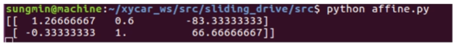

### 와핑 기법과 원근 변환


#### 이미지의 기하학적 변형 기법 : 와핑(Warping)

- 사전적으로 뒤틀림, 왜곡하다라는 의미로 영상 시스템에서 영상을 이동, 회전, 크기 변환 등을 이용해 이미지를 찌그러뜨리거나 반대로 찌그러진 이미지를 복원하기 위한 처리 기법


### 다양한 이미지 변형 방법

- 변환(Transformations)
  - 좌표 x를 새로운 좌표 x'로 변환하는 함수
  - 사이즈 변경(Scaling), 위치변경(Translation), 회전(Rotation) 등등


1. 강체변환 (Rigid-Body) : 크기 및 각도가 보존되는 변환 (ex. Translation, Rotation)
2. 유사변환 (Similarity) : 크기는 변하고 각도는 보존되는 변환 (ex. Scaling)
3. 선형변환 (Linear) : Vector 공간에서의 이동
4. Affine : 선형변환과 이동변환까지 포함하지만 선의 수평성은 유지함 (ex. 사각형 -> 평행사변형)
5. Perspective : Affine 변환에서 수평성도 유지되지 않음. 원근변환


#### Translation 변환

- 평행이동

  - 이미지를 이동하려면 원래 있던 좌표에 이동시키려는 거리만큼 더하면 됨
    - x_new = x_old + d1
    - y_new = y_old + d2
  - 위 방정식을 행렬식으로 표현하면 (컴퓨터의 연산을 위해)

  

  - 행렬식을 다시 풀어 작성하면
    - x_new = x_old + d1 = 1 * x_old + 0 * y_old + d1
    - y_new = y_old + d2 = 0 * x_old + 1 * y_old + d2
    
    


- translation.py

```
import cv2
import numpy as np

img = cv2.imread('girl.png')
rows,cols = img.shape[0:2]
dx, dy = 100, 50

mtrx = np.float32([[1, 0, dx],
                   [0, 1, dy]])  

dst = cv2.warpAffine(img, mtrx, (cols+dx, rows+dy))   


dst2 = cv2.warpAffine(img, mtrx, (cols+dx, rows+dy), None, \
                        cv2.INTER_LINEAR, cv2.BORDER_CONSTANT, (255,0,0) )

dst3 = cv2.warpAffine(img, mtrx, (cols+dx, rows+dy), None, \
                                cv2.INTER_LINEAR, cv2.BORDER_REFLECT)

cv2.imshow('original', img)
cv2.imshow('trans', dst)
cv2.imshow('BORDER_CONSTATNT', dst2)
cv2.imshow('BORDER_REFLECT', dst3)
cv2.waitKey(0)
cv2.destroyAllWindows()
```


- 실행결과


- 변환행렬을 사용하는 OpenCV 함수
  - dst = cv2.warpAffine(src, matrix, dsize, dst, flags, borderMode, borderValue)

    - src : 원본 이미지(numpy 배열)
    - matrix : 2 x 3 변환 행렬 (dtype = float32)
    - dsize : 결과 이미지의 크기 (width, height)
    - dst (optional) : 결과 이미지
    - flags (optional) : 보간법 알고리즘 플래그
    - borderMode (optional) : 외곽영역 보정 플래그 / 사진이 이동했을 때 빈 공간을 어떻게 채울 것인지 결정하는 것
    - borderValue (optional) : 외곽영역 보정 플래그가 cv2.Border_CONSTANT일 경우 사용할 색상의 값 (default = 0)

    - 리턴 값은 결과 이미지로 `dst = cv2.warpAffine(img, M, (cols,rows))` 처럼 사용할 수 있음


#### 확대 / 축소 

- 일정 비율로 확대 및 축소
  - 기존 좌표에 특정 값을 곱하면 됨
    - x_new = a1 * x_old = a1 * x_old + 0 * y_old + 0 * 1
    - y_new = a2 * y_old = 0 * x_old + a2 * y_old + 0 * 1
  - 위 방정식을 행렬식으로 표현하면


- scaling.py

```
import cv2
import numpy as np

img = cv2.imread('girl.png')
height, width = img.shape[0:2]

m_small = np.float32([[0.5, 0, 0],
                      [0, 0.5, 0]])  

m_big = np.float32([[2, 0, 0],
                    [0, 2, 0]])  


dst1 = cv2.warpAffine(img, m_small, (int(height*0.5), int(width*0.5)))


dst2 = cv2.warpAffine(img, m_small, (int(height*0.5), int(width*0.5)), \
                        None, cv2.INTER_AREA)

cv2.imshow("original", img)
cv2.imshow("small", dst1)
cv2.imshow("small INTER_CUBIC", dst2)
cv2.waitKey(0)
cv2.destroyAllWindows()
```


- 실행 결과
  - #1. 원본
  - #2. 그냥 축소
  - #3. 보간법 적용한 축소
  - #4. 그냥 확대
  - #5. 보간법 적용한 확대


#### 확대 / 축소 방법 2

- 크기 조정 OpenCV 함수
  - cv2.resize(src, dsize, dst, fx, fy, interpolation)
    - src : 원본 이미지(numpy 배열)
    
    - dsize : 확대/축소를 원하는 목표 이미지의 크기 (width, height) / 생략시 fx , fy 배율을 적용
    
    - dst : 결과 이미지
    
    - fx, fy : 변경할 크기 배율로 fx =2, fy =0.5를 넣으면 x축으로 2 배, y축으로 0.5 배로 스케일링 함 / dsize가 주어지면 dsize를 우선 적용
    
    - interpolation : 보간법 알고리즘 선택 플래그 (cv2.warpAffine()과 동일)
    
      

- resizing.py

```
import cv2
import numpy as np

img = cv2.imread('girl.png')
height, width = img.shape[0:2]


dst1 = cv2.resize(img, (int(width*0.5), int(height*0.5)), \
                         interpolation=cv2.INTER_AREA)

dst2 = cv2.resize(img, None,  None, 0.5, 1.5, cv2.INTER_CUBIC)


cv2.imshow("original", img)
cv2.imshow("small", dst1)
cv2.imshow("big", dst2)
cv2.waitKey(0)
cv2.destroyAllWindows()
```


- 실행 결과


#### 회전

- 이미지 회전을 위한 변환 행렬식
  - 사인함수와 코사인함수를 이용해서 변환
  - 일반적인 회전 행렬은 2 x 2 행렬이므로 Affine 에서 사용할 수 없음
  - cv2.getRotationMatrix2D 함수를 사용해서 2 x 3 행렬을 만들면 Affine에서 사용할 수 있음


- rotation1.py

```
import cv2
import numpy as np

img = cv2.imread('girl.png')

rows,cols = img.shape[0:2] # 영상의 크기

d45 = 45.0 * np.pi / 180 # 45도
d90 = 90.0 * np.pi / 180 # 90도 회전각도를 라디안 값으로 변경


m45 = np.float32( [[ np.cos(d45), -1* np.sin(d45), rows//2],
                    [np.sin(d45), np.cos(d45), -1*cols//4]]) # 45도 회전 행렬

m90 = np.float32( [[ np.cos(d90), -1* np.sin(d90), rows],
                    [np.sin(d90), np.cos(d90), 0]]) # 90도 회전 행렬


r45 = cv2.warpAffine(img,m45,(cols,rows)) # 45도 회전
r90 = cv2.warpAffine(img,m90,(cols,rows)) # 90도 회전

# 결과 표시
cv2.imshow("origin", img)
cv2.imshow("45", r45)
cv2.imshow("90", r90)
cv2.waitKey(0)
cv2.destroyAllWindows()
```


- 실행 결과


#### 회전 방법 2

- 회전 행렬 OpenCV 함수
  - mtrx = cv2.getRotationMatrix2D(center, angle, scale)
    - center : 회전축 중심 좌표(x,y)
    - angle : 회전할 각도(60진법)
    - scale : 확대 및 축소 비율
- 회전축, 각도, 확대/축소를 정할 수 있음


- rotation2.py

```
import cv2
import numpy as np

img = cv2.imread('girl.png')

rows,cols = img.shape[0:2] # 영상의 크기


m45 = cv2.getRotationMatrix2D((cols/2,rows/2),45,0.5)  # 회전축 중앙 / 45도 회전 / 0.5배 축소 행렬
print m45
m90 = cv2.getRotationMatrix2D((cols/2,rows/2),90,1.5) # 회전축 중앙 / 90도 회전 / 1.5배 확대 행렬
print m90

r45 = cv2.warpAffine(img, m45,(cols, rows)) # 45도 회전 & 축소
r90 = cv2.warpAffine(img, m90,(cols, rows)) # 90도 회전 & 확대

# 결과 표시
cv2.imshow("origin", img)
cv2.imshow("45", r45)
cv2.imshow("90", r90)
cv2.waitKey(0)
cv2.destroyAllWindows()
```


- 실행 결과


#### 아핀 변환(Affine)

- 크기 변환, 이동 변환, 회전 변환에서 원래 평행했던 특성을 그대로 유지
- 아래 그림처럼 평행했던 특성을 유지하면서 변환되는 것을 확인할 수 있음 (사각형이 평행사변형이 됨)
- 'ㄱ'자로 꺾인 3개의 점(빨간색, 초록색, 파랑색)을 가지고 변환 행렬을 만들어 사용함
  - cv2.getAffineTransform 함수를 사용하여 Affine 변환 행렬을 얻을 수 있음
    - 2 x 3 행렬


- affine.py

```
import cv2
import numpy as np
from matplotlib import pyplot as plt

img = cv2.imread('chess.png')

rows,cols = img.shape[0:2] # 영상의 크기


pts1 = np.float32([[50,50],[200,50],[50,200]]) # 변환전 3개 점의 좌표

pts2 = np.float32([[10,100],[200,50],[100,250]]) # 변환완료 후 3개 점의 좌표

M = cv2.getAffineTransform(pts1,pts2) # 기존 점이 새로운 점으로 이동시킬 때 필요한 행렬 찾기
print M # 계산된 행렬값을 화면에 출력

dst = cv2.warpAffine(img,M,(cols,rows)) # 구해진 행렬을 적용하여 이미지 변환

# 기존 이미지와 변환된 이미지 표시
plt.subplot(121),plt.imshow(img),plt.title('Input')
plt.subplot(122),plt.imshow(dst),plt.title('Output') 
plt.show()
```


- 실행 결과
  - 2 * 3 변환 행렬 출력




#### 원근 변환(Perspective)

- 원근법을 적용한 변환

  - 직선의 성질만 유지하고 선의 평행성은 유지가 되지 않는 변환
  - 기차길은 서로 평행하지만 원근 변환을 거치면 평행성은 유지되지 못하고 하나의 점에서 만나는 것 처럼 보임
  - 반대의 변환도 가능한데 이는 **차선 추출에 사용**됨

- 4개의 점을 통해 변환행렬을 만들어 사용(ex. 사다리꼴 -> 네모, 네모-> 사다리꼴)

  - cv2.getPerspectiveTransform 함수를 사용하여 Perspective 변환 행렬을 얻을 수 있음

    - 이동할 4개 점의 좌표가 필요
    - 결과값은 3 x 3 행렬

  - cv2.warpPerspective() 함수에 얻은 변환 행렬값을 적용해서 이미지 변환

    


- perspective.py

```
import cv2
import numpy as np
from matplotlib import pyplot as plt

img = cv2.imread('chess.png')

rows,cols = img.shape[0:2] # 영상의 크기

pts1 = np.float32([[20,20],[20,280],[380,20],[380,280]]) # 변환 전 4개 점의 좌표

pts2 = np.float32([[100,20],[20,280],[300,20],[380,280]]) # 변환 완료 후 4개 점의 좌표

# 4개 점의 위치에 다른 색 원 그리기
cv2.circle(img, (20,20), 20, (255,0,0),-1)
cv2.circle(img, (20,280), 20, (0,255,0),-1)
cv2.circle(img, (380,20), 20, (0,0,255),-1)
cv2.circle(img, (380,280), 20, (0,255,255),-1)

# 4개 점의 이동 정보를 통해 행렬 계산
M = cv2.getPerspectiveTransform(pts1, pts2)
print M # 구해진 행렬값 화면에 표시

# 구해진 행렬을 적용하여 이미지 변환
dst = cv2.warpPerspective(img, M, (cols,rows))

# 기존 이미지와 변환된 이미지 표시
plt.subplot(121),plt.imshow(img),plt.title('image')
plt.subplot(122),plt.imshow(dst),plt.title('Perspective')
plt.show()
```


- 실행 결과
  - 3 x 3 변환 행렬 출력


### 차선 검출에 Warping을 사용?

- 3차원 공간(도로)의 원근 현상을 2번 그림의 체스판을 위에서 보듯이 펼치면 좋을 것 같음 -> Bird Eye View 라고 함
- Perspective 변환 적용


- Bird Eye View를 통해 차선을 찾기가 수월함
  - 실제 곡선 도로는 컴파스를 통해 원을 그리듯이 그리는데, 회전 구간에 들어갔을 때 꺾은 핸들 그대로를 유지하면 차선을 유지하면서 주행 가능
  - 직선 도로는 물론 곡선 차선을 Bird Eye View를 통해 얼만큼 휘어져 있는지 곡률 반경을 알아내 계산하기 쉬워짐


### 도로 이미지에 대한 영상처리

1. Perspective 변환을 통해 도로 이미지를 Bird Eye View로 변형 처리(Warping 과정)
2. 차선을 찾음
3. 찾은 차선을 다시 역행렬 변환 시켜서 원본 처럼 만듬
4. 차선만 있는 Warped Back Image를 원본 이미지에 오버레이


