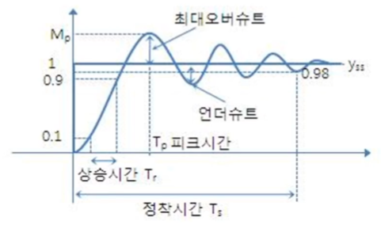

### 조향각 제어

- 자동차 운전은 조향 및 속도 제어를 해야 함

  - 조향각 제어
    - 직선 차로 : 정면으로 직진
    - 곡선 차로 : 차로가 휘어진 방향으로 조향

  - 속도 제어
    - 직선 차로 : 빠르게
    - 곡선 차로 : 적절히 느리게(차선 이탈 방지)

- 양쪽 차선의 위치를 찾아서 양쪽 차선의 중앙값을 구하고 화면의 중앙과 비교해서 차이만큼 핸들을 꺾음
- 차선의 중앙과 중앙선과의 차이가 몇 픽셀일 때 몇 도를 꺾어야 하는가? -> 많은 시행착오를 통해 알아내야 함

- 조향각 제어의 문제점
  - 카메라를 통한 차선 인식의 한계점
    - 빛, 그늘, 반사광, 장애물로 인해 차선을 가리는 경우
    - 급커브 등 차선이 시야에서 벗어나 안 보이는 경우
  - 차선 인식에 오류가 생기면 조향각 변동이 심해짐(핸들을 확확 꺾음)

- 안정적인 주행을 위해서는 부드러운 핸들링이 필요함 -> 조향각 값에 대한 필터링을 하자

#### 필터 기반 조향각 제어

1. 카메라에서 영상을 찍음
2. 찍은 영상을 기반으로 차선을 찾음
3. 찾은 차선에 의해 조향각이 계산 됨
4. 과격한 조향각을 필터링 함
5. 모터 제어로 값을 보냄

- 과격한 값에 대하여 필터링이 없는 경우 핸들이 좌, 우를 계속 왔다 갔다 함
- 과격한 값에 대하여 필터링을 한 경우, 한쪽으로 천천히 부드럽게 꺾는 효과가 나옴

##### 필터

- 평균 필터(Average Filter) : 처음부터 끝 까지
- 이동평균 필터(Moving Average Filter) : 옛날 데이터는 버리고, 정한 개수의 최근 데이터들의 평균
- 가중 이동평균 필터 : 이동 평균 필터를 진행하면서 가중치를 같이 줌 (옛날 것에는 1을 곱하고, 그 다음의 값에는 2를 곱하고... 최근 것에는 더 높은 숫자를 곱하는 형식)
- 저주파 통과 필터(Low-Pass Filter) :  이동 평균 필터를 진행하면서 가중치를 지수 가중으로 곱함, 최신의 데이터일 수록 더욱 더 큰 가중치를 곱함

##### 핸들링에는 어떤 필터가 적당할까?

- 이동평균 필터 : 과거 값은 버리자
- 가중 이동평균 필터 : 최신 값이 더 중요함

##### 어느 데이터에 필터를 적용해야 할까?

- 2가지 방법

  - 차선 위치 데이터

  - 조향각 데이터

##### 조향각 데이터에 필터 적용

- 조향각 데이터가 아닌 차선 위치 데이터에 적용해보자
- 차량의 속도가 느릴 때와 빠를 때, 어떤 필터가 효과적인지 알아보자

#### PID 기반 조향각 제어

##### 2개의 Control 기법

- Open Loop Control

- Closed Loop Control(피드백 제어)
  - 센서 등을 통해 데이터를 수집하고, 수집된 데이터를 기반으로 반복적인 피드백으로 제어하는 기법
  - **PID Control**이 대표적인 Closed Loop Control

1. Signal을 넣어주고 Controller가 반응을 해서 Actuator을 통해 Plant(제어하고자 하는 물체)에 영향을 미침

2. Plant에서 결과 값을 반환하고 Sensor가 센싱해서 처음에 의도했던 바와의 차이를 Error로 반환

3. Error를 발생하고 Controller가 Error에 따라 다르게 수정하여 Actuator를 구동하여 Plant에 영향을 줌

4. Plant에서 결과 값이 조금 더 Error가 줄어드는 방법으로 조정되고, 이러한 작업을 계속 반복하여 Error를 없엠

- 시속 60km/h로 달리려는 자동차가 있는데 자동차의 속도를 높이는 on/off 버튼이 있을 때 피드백 제어를 하면 어떻게 될까?
  - 60km/h 이하일 때는 스위치 on, 이상일 때는 off를 해도 60km/h로 수렴하지 못하고 상당기간 진동하게 됨
- 계속해서 on/off를 반복하면 출력 값의 변화가 매우 크고 시간이 지나도 목표 값과의 오차는 줄지 않음

##### PID

- 비례, 적분, 미분의 조합으로 적절한 값을 도출하는 기법
- Proportional : 비례 / Integral : 적분 / Differential : 미분

- 제어 대상의 목표값(desired value)과 출력값(output)과의 차이로 제어 값을 계산

- 주요 용어
  - 오버슈트 : 최종 정상상태 값을 넘어서는 상승 오차
  - 피크 시간 : 가장 큰 오버슈트가 발생했을 때 시간 (대부분 처음 오버슈트가 가장 큼)
  - 상승 시간 : output의 0.1부터 0.9까지 이를 때 걸리는 시간
  - 정착 시간 : 최종 정상 상태에 도달하는 시간

- PID 제어 수식

##### P 제어

- 피드백 제어 신호가 오차에 비례하게 만드는 제어 방법

- PID 제어기가 없을 경우
  - 목표값에 도달하지 않고, 진동이 심함

- PID 제어기를 넣은 경우
  - P gain 값을 작게 하면 (P-gain : 1 / I-gain : 1 / D-gain : 1)
    - 목표값에 도달은 하지만, 오버슈트가 생기며 반응속도가 느림

  - PID 제어기를 넣은 경우
    - P gain 값을 크게 하면 (P-gain : 5 / I-gain : 1 / D-gain : 1)
      - 반응속도가 빨라졌지만, 정상상태 오차가 발생함(목표치에 도달하지 못하고 미세한 차이가 발생)

##### I 제어

- 적분을 이용하여 비례 제어에서 남아있는 오차를 제거하는 제어 방법

- 출력값이 목표값에 빠르게 도달하고 수렴하게 함
- 오차가 계속 쌓이면 조작량에 영향을 미쳐 갭을 없엠

  - PID 제어기를 넣은 경우
    - I gain 값을 크게 하면 (P-gain : 5 / I-gain : 2 / D-gain : 1)
      - 반응속도가 빨라지고, 정상상태 오차가 없어졌으나 오버슈트가 크게 발생함

##### D 제어	

- 미분을 이용하여 진동을 줄이고 안정성을 향상하는 제어 방법(브레이크라고 생각하면 됨)
- 급격한 출력값의 변동이 발생할 때 급격하게 변하지 않도록 함
- 오차가 상수일 경우 D 제어기의 출력은 0(상수 미분 값은 0이므로)이 되어 정상 상태 오차를 줄일 수 없음
  - 일반적으로 단독으로 D 제어기만 사용하는 경우는 없음
- 특정 신호가 급변하는 경우 미분 제어기의 출력이 급격하게 커져, 시스템을 파괴하는 경우가 있음

- PID 제어기를 넣은 경우
  - D gain 값을 크게 하면 (P-gain : 5 / I-gain : 2 / D-gain : 2.5)
    - 오버슈트가 감소함 (브레이크를 쎄게 밟는다고 생각하면 됨)

##### PID 예시

- input = 1
- PID 제어기가 없는 경우 : 원하는 결과 값에 도달하지 못하고 진동이 심함

- P-gain : 1 / I-gain : 1 / D-gain : 1
  - 목표하는 값에는 도달하지만, 오버슈트가 발생하고, 반응 속도가 느림

- P-gain : 5 / I-gain : 1 / D-gain : 1
  - 오버슈트는 여전히 발생하지만 빠른 응답속도를 가지고 정상상태 오차가 발생함

- P-gain : 5 / I-gain : 2 / D-gain : 1
  - 오버슈트는 커졌지만, 빠른 반응속도를 가지고 정상상태 오차가 없어짐

- P-gain : 5 / I-gain : 2 / D-gain : 2.5
  - 작은 오버슈트(6.3%)를 가지고, 정상상태 오차가 없음

###### 정리

- 가장 이상적인 제어 결과는 빠른 응답속도를 가져야하며, 오버슈트가 발생하지 않고 정상상태 오차가 발생하지 않아야 함

- gain값 사이의 trade-off(하나가 좋아지면 하나가 나빠지고) 때문에 현실적으로 가능하지 않으므로 적절히 타협을 봐야함

  - 타협의 기준을 몇 프로 이하의 오버슈트, 몇 초의 정착시간 등으로 설정함

  e.g.  5% 이내의 오버슈트, 0.2초 이내의 정착시간을 주로 설정함

##### 자율주행 자동차의 PID 제어

https://www.youtube.com/watch?v=4Y7zG48uHRo

- 핸들링을 위한 PID 제어 목표 : CTE(Cross Track Error) 값을 0으로 만들기

###### P 제어

- 목표치까지 오차가 크면 제어를 많이 하고, 작으면 조금만 함(비례적으로)
- 목표 지점까지 거리 오차가 크면 핸들을 많이 꺾고 적으면 조금만 꺾음

- P gain 값이 클 수록 금방 목표치까지 다가감

###### D 제어

- 반대 방향으로 브레이크를 걸음(아래의 그림에서 D 제어로 인해 초록색 만큼은 아니고 빨간색 만큼 조향각을 꺾음)

- D gain이 너무 작으면 반대 방향으로 브레이크를 빠르게 밟지 못해 출렁거림(Underdamped)이 존재하고 D gain이 너무 크면 브레이크를 심하게 걸어 반대 방향으로 쉽게 가지를 못함(Overdamped) 

###### I 제어

- 조금 더 꺾어도 돼 라고 알려 주는 역할을 함

- 의도치 않게 궤적을 벗어 났을 때 원위치 할 수 있는지 확인을 해봄 
  - I gain 값이 너무 작으면 정상 상태 오차가 발생하고 I gain 값이 너무 크면 원위치로 되돌아가기 위해 너무 심하게 핸들을 꺾어서 출렁거는 현상이 발생함. 적당한 I gain 값은 출렁거리는 현상도 없애고 정상 상태 오차도 극복함

