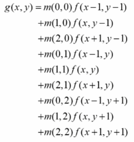

### 영상의 필터링

- 영상에서 필요한 정보만 통과시키고 원치 않는 정보는 걸러내는 작업
- 블러링, 샤프닝, 잡음 제거, 에지 검출 등


#### 주파수 공간에서의 필터링(frequency domain filtering)

- 푸리에 변환(Fourier transform)을 이용하여 영상을 주파수 공간으로 변환하여 필터링을 수행하는 방법
  - lenna 영상을 푸리에 변환을 거치면 2번째 이미지와 같이 나옴. 
  - 푸리에 변환을 한 이미지의 가운데는 저주파 성분 바깥은 고주파 성분이라고 이야기함
  - 저주파 성분만 통과를 시키는 가운데 값이 크고 나머지는 0으로 채워져 있는 3 번째 이미지 필터를 주파수 공간의 2 번째 이미지와 곱함
  - 그러면 4 번째 이미지와 같이 결과가 나오고 이 결과를 푸리에 역변환을 수행하면 뿌옇게 된 lenna 이미지를 만들 수 있음


#### 공간적 필터링(spatial domain filtering)

- 영사의 픽셀 값을 직접 이용하는 필터링 방법
  - 영상 좌표의 픽셀 값과 주변 픽셀 값을 동시에 사용
- 주로 마스크(mask) 연산을 이용함
- OpenCV에서는 공간적 필터링 마스크 크기가 커질 경우 주파수 공간에서 필터링을 수행함
- 다양한 모양과 크기의 마스크
  - 필터링에 사용되는 마스크는 다양한 크기와 모양을 지정할 수 있지만 대부분 3 x 3 정방향 필터를 사용


- 마스크 형태와 값에 따라 필터의 역할이 결정됨
  - 영상 부드럽게/날카롭게 만들기
  - 잡음 제거
  - 엣지(Edge) 검출


- 3 x 3 크기의 마스크를 이용한 공간적 필터링
  -  3x3 9개의 마스크 행렬 값과 입력 영상의 픽셀 값을 곱해서 그 결과를 다 더해서 출력 영상의 가운데 하나의 픽셀 값으로 설정함
  - Correlation(Convolution)이라고 함





- Convolution vs Cross-Correlation(Correlation)
  - g의 좌우 대칭 하여 곱하는 차이


- (1,1) 좌표랑 (2,1) 좌표에서의 3 x 3 크기의 마스크를 이용한 공간적 필터링


##### 최외곽 픽셀 처리


- OpenCV 필터링에서 지원하는 가장자리 픽셀 확장 방법
  - BORDER_REFLECT_101이 맨 끝의 픽셀은 제외하고 거울처럼 대칭하여 픽셀 확장
  - BORDER_REFLECT는 맨 끝의 픽셀도 대칭하여 픽셀 확장
  - BORDER_REPLICATE는 맨 끝의 픽셀로 다 채움
  - BORDER_CONSTANT는 다 0으로 채움


- 영상 가장자리 픽셀 확장 함수

```
void copyMakeBorder(InputArrayt src, OutputArray dst, int top, int bottom, int left, int right, int borderType, const Scalar& value = Scalar());
```

- src : 입력 영상
- dst : 출력 영상, Size(src.cols + left + right, src.rows + top + bottom)
- top : 위쪽 확장 크기(픽셀 단위)
- bottom : 아래쪽 확장 크기(픽셀 단위)
- left : 왼쪽 확장 크기(픽셀 단위)
- right : 오른쪽 확장 크기(픽셀 단위)
- borderType : 가장자리 픽셀 확장 방법
- value : borderType이 BORDER_CONSTANT 일 경우 사용할 값


##### 기본적인 2D 필터링 함수

```
void filter2D(InputArray src, OutputArray dst, int ddepth, InputArray kernel, Point anchor = Point(-1,-1), double delta = 0, int borderType = BORDER_DEFAULT);
```

- src : 입력 영상
- dst : 출력 영상
- ddepth : 원하는 결과 영상의 깊이를 지정함. -1일 경우 src와 같은 깊이를 사용
  - 필터링의 결과 영상을 그레이스케일 영상 형식으로 만들 수 있지만, 경우에 따라 실수형 행렬로 결과 영상인 dst 행렬을 만들 수 있음
  - 필터링 결과를 실수형 행렬로 만드는 이유는 필터링 한번만으로 결과가 바로 나오는 것이 아니라 여러번의 필터링을 거칠 수 있고 필터링외에 다른 복잡한 연산을 거쳐 최종적인 결과 영상을 생성함
    - 필터링을 수행한 결과 값이 실수 형태로 계산되었을 경우, 그레이스케일로만 출력을 하면 소수점 이하의 값들이 짤려 나감으로 이후 연산에서 정확도가 떨어짐


- kernel : 필터 마스크 행렬. 1채널 실수형
- anchor : 고정점 위치 (-1, -1)이면 필터 중앙을 고정점으로 사용
- delta : (optional)추가적으로 더할 값
- borderType : 가장자리 픽셀 처리 방법


#### filter2D() 함수를 이용한 앰보싱 필터

- 직물이나 종이, 금속판 등에 올록볼록한 형태로 만든 객체의 윤곽 또는 무늬
- 입력 영상을 엠보싱 느낌이 나도록 변환하는 필터


- 결과를 효과적으로 보여주기 위해 결과 영상에 128을 더해서 보여줌


```
#include <iostream>
#include "opencv2/opencv.hpp"

using namespace std;
using namespace cv;

int main(void)
{
	Mat src = imread("rose.bmp", IMREAD_GRAYSCALE);

	if (src.empty()) {
		cerr << "Image load failed!" << endl;
		return -1;
	}

	float data[] = { -1, -1, 0, -1, 0, 1, 0, 1, 1 };
	Mat emboss(3, 3, CV_32FC1, data);

	Mat dst;
	filter2D(src, dst, -1, emboss, Point(-1, -1), 128);

	imshow("src", src);
	imshow("dst", dst);
	waitKey();
}
```


- 실행결과


